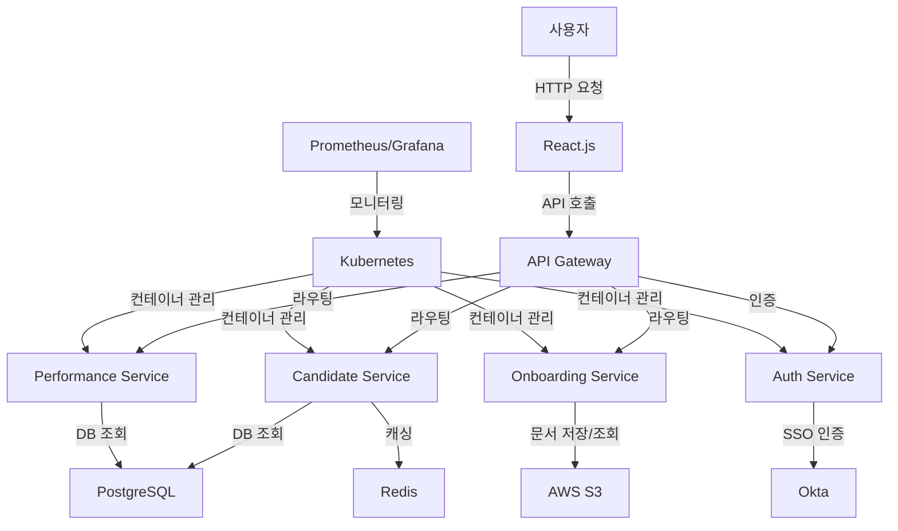

# AI 아키텍처 설계 가이드

## 원본 요구사항
시스템 아키텍처 설계 문서 (Architecture Design Document)
프로젝트명: [AGS 운영관리 시스템 (다국적 인재 소싱 관리 시스템)]
1. 프로젝트 목표 (Goal)
과제: 다국적 기술 인력을 소싱하고, 평가, 계약, 온/오프보딩 및 성과를 관리하는 과정이 여러 부서(PM, 사업팀, 협력사, 정보보호팀 등)에 걸쳐 분절되어 있고 수작업에 의존하여 비효율적입니다. 이로 인해 데이터의 정합성 확보가 어렵고, 통합적인 현황 파악 및 신속한 의사결정에 한계가 있습니다.
목표: 다국적 기술 인력 소싱부터 성과 관리까지의 전 과정을 지원하는 **'통합 운영관리 플랫폼'**을 구축하여, 인력 소싱에 소요되는 기간을 30% 단축하고 데이터 기반의 투명한 성과 관리를 통해 운영 효율성을 50% 향상시킨다.
2. 미래 비전 (Future Vision, 3~5년 후)
현재의 운영관리 시스템은 향후 AI 기반의 최적 인재 추천 및 프로젝트 리스크 예측 기능과 결합하여, 단순한 인력 관리 시스템을 넘어 데이터에 기반한 **'전략적 인적자원(HR) 의사결정 지원 플랫폼'**으로 발전시킨다.
3. 고객(사용자) 핵심 가치 (Customer Value)
1순위: 효율성 (Efficiency): 분절된 업무 프로세스를 통합하여 수작업을 최소화하고 업무 생산성을 극대화합니다.
2순위: 데이터 가시성 및 정확성 (Visibility & Accuracy): 계획 대비 실적(KPI), 인력 현황 등 핵심 데이터를 실시간으로 정확하게 파악하여 데이터 기반의 의사결정을 지원합니다.
3. 순위: 보안 및 통제 (Security & Control): 역할 기반 접근 제어와 감사 추적 기능으로 중요 정보와 문서를 안전하게 관리합니다.
4순위: 사용 편의성 (Usability): 다양한 사용자 역할(PM, 협력사, 운영팀 등)을 고려한 직관적이고 반응성이 뛰어난 UI를 제공합니다.
4. 미션 크리티컬 기능 (Mission-Critical Functions)
핵심 기능 1: 인재 검색, 제안서(SOW) 관리 및 평가를 포함한 인재 소싱 및 계약 프로세스
핵심 기능 2: 월별 투입 계획 등록 및 구매 시스템과 연동된 일일 실적 데이터 수집 및 KPI 자동 계산
핵심 기능 3: 온/오프보딩 감사를 위한 보안 서약서 등 주요 문서의 안전한 관리 및 다운로드
핵심 기능 4: 역할 기반 사용자 인증 및 권한 관리
5. 품질 속성 (Quality Attributes / 비기능적 요구사항)
5.1. 성능 (Performance)
응답 시간 (Latency):
주요 사용자 요청의 목표 응답 시간: 다중 필터를 사용한 후보자 검색 API - 500ms 이내
주요 시스템 간 호출의 목표 응답 시간: SOW 문서(PDF) 생성 및 다운로드 시작 - 3초 이내
처리량 (Throughput):
평균 처리량: 500 TPS (업무 시간 내 평균 요청)
최대(피크) 처리량: 구매 시스템으로부터 일일 실적 데이터를 수신하는 배치 작업 시 2,000 TPS 처리
5.2. 확장성 (Scalability)
부하 대응: 시스템의 주요 기능은 마이크로서비스로 분리하여 특정 기능(예: 실적 집계)에 부하가 집중될 경우 해당 서비스만 독립적으로 컨테이너 수를 자동으로 확장(Auto-scaling)하도록 설계한다.
기능 확장: MSA 구조를 채택하여 향후 신규 비즈니스 요구사항(예: 교육 관리 기능) 발생 시 기존 시스템에 미치는 영향을 최소화하고 독립적으로 서비스를 개발/배포할 수 있도록 설계한다.
5.3. 가용성 및 재해 복구 (Availability & DR)
가용성 목표: 99.9% (기업 내부 시스템임을 고려, 연간 약 8.76시간 이내의 장애 허용)
재해 복구 목표 (RTO/RPO):
RTO (복구 목표 시간): 1시간 이내 (쿠버네티스 환경에서의 자동 복구 및 백업 복원 포함)
RPO (복구 목표 시점): 15분 이내 (주기적인 DB 스냅샷 백업 기준)
5.4. 신뢰성 및 데이터 정합성 (Reliability & Consistency)
장애 허용 (Fault Tolerance): Kubernetes의 Liveness/Readiness Probe를 활용하여 비정상 상태의 컨테이너(Pod)를 자동으로 재시작하여 서비스 장애를 최소화한다.
데이터 정합성: 구매 시스템으로부터 수신한 일일 실적 데이터는 메시지 큐(또는 Staging 테이블)에 임시 저장 후 트랜잭션을 보장하며 DB에 반영하여 데이터 유실을 방지한다.
5.5. 보안 및 규제 준수 (Security & Compliance)
인증/인가: Okta와 연동된 OAuth 2.0을 통해 SSO(Single Sign-On) 인증을 구현하고, 시스템 내에서는 **역할 기반 접근 제어(RBAC)**를 통해 메뉴 및 데이터 접근 권한을 엄격히 통제한다.
데이터 보호: 보안 서약서 등 민감한 문서는 암호화하여 저장하고, 모든 통신 구간은 TLS로 암호화한다.
감사 및 로깅: 주요 데이터의 변경 이력과 사용자 활동(문서 다운로드 등)에 대한 감사 로그를 기록하고 보관한다.
6. 아키텍처 스타일 및 기술 결정
6.1. 전체 아키텍처 스타일
핵심 도메인을 중심으로 시스템을 4개의 논리적 단위로 분리하는 **MSA(마이크로서비스 아키텍처)**를 채택하여 서비스의 독립성과 확장성을 확보한다.
6.2. 인프라 및 배포 환경 (Infrastructure & Deployment)
배포 환경: 모든 마이크로서비스는 Docker 컨테이너로 패키징하여 Kubernetes 클러스터 환경에 배포한다.
CI/CD: GitHub Actions를 활용하여 소스코드 빌드, 테스트, 컨테이너 이미지 생성 및 Kubernetes 배포 파이프라인을 자동화한다.
6.3. 시스템 연동 및 API 전략 (Integration & API)
외부 연동: 구매 시스템과는 REST API를 통해 JSON 형식의 일일 실적 데이터를 주기적으로 연동한다.
내부 통신: 마이크로서비스 간의 동기식 호출은 REST API를 사용한다.
인증 연동: Okta와의 연동을 통해 전사 표준 인증 체계인 OAuth 2.0 기반의 SSO를 구현한다.
6.4. 핵심 도메인/서비스 분해 (Decomposition)
비즈니스 기능 단위를 기준으로 다음과 같이 4개의 마이크로서비스로 분해한다.
인재 소싱 및 평가 서비스: 후보자 검색, SOW 관리, 제안서 및 평가 관리
온/오프보딩 감사 서비스: 프로젝트 및 투입 인력 정보 조회, 보안 문서 관리
계획 및 성과 관리 서비스: 월별 투입 계획, 일일 실적 집계, KPI 대시보드
지식 관리 서비스: 가이드, Q&A, Lessons Learned 관리
6.5. 기술 스택 (Tech Stack)
백엔드: Java / Spring Boot - 엔터프라이즈 환경에서의 안정성과 생산성, 풍부한 생태계.
프론트엔드: Vue 3 - 반응적이고 효율적인 UI 개발, 다국어(한/영) 지원 용이성.
데이터베이스: PostgreSQL (단일 인스턴스), MyBatis (SQL에 대한 직접적인 제어 및 튜닝 요구사항 충족).
인프라: Kubernetes, Docker, GitHub Actions
인증: Okta (OAuth 2.0)
7. 주요 아키텍처 결정 사항 (ADR: Architecture Decision Record)
ADR-001: 데이터베이스 영속성 기술로 MyBatis 채택 (JPA 미사용)
결정(Decision): 데이터베이스 접근 기술로 ORM 프레임워크인 JPA 대신 SQL Mapper인 MyBatis를 사용한다.
배경/이유(Context/Reason): 본 시스템은 복잡한 조건의 인력 검색, 프로젝트별/등급별 실적 집계 등 복잡한 통계 및 리포팅 쿼리의 비중이 높다. MyBatis를 사용하면 SQL에 대한 완전한 제어가 가능하여, ORM 사용 시 발생할 수 있는 N+1 문제나 예측 불가능한 쿼리로 인한 성능 저하 리스크를 원천적으로 차단하고 세밀한 SQL 튜닝을 용이하게 할 수 있다.
대안(Alternatives Considered): JPA(Hibernate) 사용을 고려했으나, 복잡한 동적 쿼리 작성의 어려움과 런타임 시 SQL 성능 예측의 불확실성으로 인해 프로젝트 요구사항에 부합하지 않는다고 판단하여 제외했다.

---

## 1. 요구사항 분석 결과
# AGS 운영관리 시스템 (다국적 인재 소싱 관리 시스템) 요구사항 분석

## 핵심 기능 (Core Features)
1. 인재 소싱 및 계약 프로세스: 인재 검색, 제안서(SOW) 관리 및 평가 기능 포함.
2. 성과 관리: 월별 투입 계획 등록 및 일일 실적 데이터 수집, KPI 자동 계산.
3. 온/오프보딩 감사: 보안 서약서 등 주요 문서의 안전한 관리 및 다운로드.
4. 사용자 인증 및 권한 관리: 역할 기반 사용자 인증 및 권한 관리 기능.

## 주요 목표 (Key Objectives)
- 다국적 기술 인력 소싱부터 성과 관리까지의 전 과정을 지원하는 통합 운영관리 플랫폼 구축.
- 인력 소싱에 소요되는 기간을 30% 단축.
- 데이터 기반의 투명한 성과 관리를 통해 운영 효율성을 50% 향상.

## 사용자 및 규모 (Users & Scale)
- 주요 사용자 그룹: 프로젝트 매니저(PM), 사업팀, 협력사, 정보보호팀 등.
- 예상 트래픽: 평균 500 TPS, 최대 2,000 TPS의 처리량을 지원.

## 성능/보안/기타 제약조건 (Constraints)
- 응답 시간: 후보자 검색 API는 500ms 이내, SOW 문서 생성 및 다운로드는 3초 이내.
- 가용성 목표: 99.9% (연간 약 8.76시간 이내의 장애 허용).
- 데이터 보호: 민감한 문서는 암호화하여 저장하고, 모든 통신은 TLS로 암호화.
- 인증: Okta와 연동된 OAuth 2.0을 통한 SSO 인증 구현.
- 장애 허용 및 데이터 정합성: Kubernetes의 Liveness/Readiness Probe를 활용하여 서비스 장애 최소화 및 데이터 유실 방지.

---

## 2. 아키텍처 설계안
### [아키텍처 설계안]

#### 1. 아키텍처 스타일 제안
**제안: 마이크로서비스 아키텍처**
- **이유**:
  - **확장성**: 다국적 인재 소싱 및 성과 관리 시스템은 다양한 기능을 포함하며, 각 기능의 트래픽 및 처리량이 다를 수 있습니다. 마이크로서비스는 각 기능을 독립적으로 배포 및 확장할 수 있어, 예상 트래픽(500~2,000 TPS)을 효과적으로 처리할 수 있습니다.
  - **유지보수성**: 독립적인 서비스로 분리하여 각 기능을 별도로 개발 및 유지보수 가능. 예를 들어, 성과 관리 서비스와 온/오프보딩 감사 서비스는 서로 다른 팀이 관리할 수 있습니다.
  - **가용성**: 장애가 발생하더라도 특정 서비스에 국한되며, 전체 시스템의 가용성을 유지할 수 있습니다.
  - **기술 다양성**: 각 서비스에 적합한 기술 스택을 선택할 수 있어 최적화된 성능을 제공.

---

#### 2. 주요 기술 스택 추천
**프론트엔드**:
- **React.js**:
  - **근거**: 컴포넌트 기반 설계로 복잡한 UI를 효율적으로 관리 가능. 다국적 사용자 대상의 인터랙티브한 UI 구현에 적합.
  - **추가 도구**: TypeScript를 활용하여 안정성과 코드 품질 향상.

**백엔드**:
- **Node.js** (Express.js 프레임워크):
  - **근거**: 비동기 처리에 강점이 있어 높은 TPS를 처리하는 API 서버에 적합. 다양한 마이크로서비스와 통신이 용이.
  - **추가 도구**: NestJS를 활용하여 모듈화된 구조를 제공.

**데이터베이스**:
- **PostgreSQL**:
  - **근거**: 관계형 데이터베이스로, SOW 관리 및 성과 관리 데이터를 효율적으로 저장. ACID 특성을 제공하여 데이터 정합성 보장.
- **Redis**:
  - **근거**: 후보자 검색 API의 빠른 응답 시간(500ms)을 보장하기 위해 캐싱 솔루션으로 활용.

**인프라**:
- **Kubernetes**:
  - **근거**: 컨테이너 기반 배포 및 관리로 장애 허용 및 자동 복구 기능 제공. Liveness/Readiness Probe를 활용하여 서비스 안정성 강화.
- **AWS 클라우드**:
  - **근거**: 글로벌 사용자 대상의 안정적인 서비스 제공을 위해 AWS의 글로벌 인프라 활용. 주요 서비스:
    - **AWS EC2**: 마이크로서비스 컨테이너 실행.
    - **AWS RDS**: PostgreSQL 관리형 데이터베이스.
    - **AWS S3**: 보안 서약서 등 주요 문서 저장.
    - **AWS CloudFront**: 글로벌 콘텐츠 배포 네트워크(CDN)로 빠른 응답 시간 보장.
    - **AWS KMS**: 민감한 데이터 암호화.

**인증 및 보안**:
- **Okta OAuth 2.0**:
  - **근거**: 역할 기반 사용자 인증 및 SSO 구현.
- **TLS**:
  - **근거**: 모든 통신 암호화로 데이터 보호.

---

#### 3. 시스템 구성 요소 및 데이터 흐름
**핵심 구성 요소**:
1. **Frontend**: React.js 기반의 웹 애플리케이션.
2. **API Gateway**: 모든 마이크로서비스의 진입점. 인증 및 요청 라우팅 처리.
3. **Microservices**:
   - **Candidate Service**: 인재 검색 및 제안서 관리.
   - **Performance Service**: 월별 투입 계획 및 KPI 계산.
   - **Onboarding Service**: 보안 서약서 관리 및 다운로드.
   - **Auth Service**: Okta OAuth 2.0 기반 인증 및 권한 관리.
4. **Database**:
   - PostgreSQL: 관계형 데이터 저장.
   - Redis: 후보자 검색 결과 캐싱.
5. **Storage**: AWS S3를 활용한 문서 저장.
6. **Monitoring**: Prometheus와 Grafana를 활용한 실시간 모니터링.

---

**데이터 흐름 및 상호작용**:


---

#### 4. 참고 자료 반영
- **참고 자료 없음**: 제공된 참고 자료가 없으므로, 요구사항 분석 결과를 기반으로 설계되었습니다.
- **요구사항 반영**:
  - **응답 시간**: Redis를 활용한 캐싱으로 후보자 검색 API의 500ms 응답 시간 충족.
  - **가용성**: Kubernetes의 Liveness/Readiness Probe로 99.9% 가용성 목표 달성.
  - **보안**: TLS 통신 암호화 및 AWS KMS를 활용한 데이터 암호화.
  - **SSO 인증**: Okta OAuth 2.0 연동으로 역할 기반 인증 구현.

---

#### 5. 결론
이 설계는 요구사항을 충족하며 확장 가능하고 안정적인 시스템을 제공합니다. 마이크로서비스 아키텍처를 기반으로 각 기능을 독립적으로 관리하며, AWS 클라우드 인프라와 Kubernetes를 활용하여 글로벌 사용자 대상의 높은 가용성과 성능을 보장합니다.

---

## 3. 보안 검토 및 제안
### 보안 검토 및 제안

#### 1. 잠재적인 보안 위협 식별
아키텍처 설계안을 분석하여 각 구성 요소에서 발생할 수 있는 보안 위협을 식별합니다.

##### 네트워크 보안
- **위협**:
  - API Gateway를 통한 DDoS 공격.
  - 네트워크 트래픽 도청 및 중간자 공격(MITM).
  - Kubernetes 클러스터 내부 통신의 보안 취약점.
- **취약점**:
  - API Gateway가 적절한 요청 제한 및 인증을 수행하지 않을 경우, 악의적인 트래픽으로 인해 서비스가 중단될 수 있음.
  - TLS가 제대로 구성되지 않으면 데이터가 전송 중에 탈취될 가능성.

##### 데이터 보안
- **위협**:
  - 민감한 문서(SOW, 보안 서약서 등)의 무단 접근 및 유출.
  - 데이터베이스(PostgreSQL) 및 캐싱 솔루션(Redis)의 데이터 탈취.
  - 데이터 암호화 키의 유출로 인한 암호화된 데이터 복호화.
- **취약점**:
  - AWS S3 버킷이 잘못된 권한 설정으로 인해 외부에서 접근 가능할 위험.
  - 데이터베이스 접근 권한이 과도하게 부여될 경우 내부자 위협 발생 가능.

##### 애플리케이션 보안
- **위협**:
  - 마이크로서비스 간의 인증 및 권한 관리 미비로 인한 권한 상승 공격.
  - 애플리케이션 코드의 취약점(예: SQL Injection, XSS, CSRF).
- **취약점**:
  - 역할 기반 접근 제어(RBAC)가 제대로 구현되지 않으면 민감한 데이터에 대한 무단 접근 가능.

##### 접근 제어
- **위협**:
  - Okta OAuth 2.0 설정 오류로 인해 인증 우회 가능.
  - 관리자 계정 탈취로 인한 시스템 전체 권한 획득.
- **취약점**:
  - 다국적 사용자 그룹에 대해 적절한 권한 분리가 이루어지지 않을 경우 데이터 유출 가능.

##### 로깅 및 모니터링
- **위협**:
  - 로그 데이터의 무단 접근 및 조작.
  - 실시간 모니터링 미비로 인해 보안 사고 탐지 지연.
- **취약점**:
  - 로그 데이터가 암호화되지 않으면 민감한 정보가 유출될 가능성.

---

#### 2. 보안 강화 방안 제안
식별된 위협을 완화하기 위한 구체적인 보안 강화 방안을 제안합니다.

##### 네트워크 보안
1. **DDoS 방어**:
   - AWS Shield 및 AWS WAF(Web Application Firewall)를 활용하여 API Gateway에 대한 DDoS 공격 방어.
   - API Gateway에서 요청 제한(Rate Limiting) 및 IP 차단 규칙 설정.

2. **TLS 암호화**:
   - 모든 네트워크 통신에 TLS 1.2 이상을 적용하여 데이터 전송 중 도청 방지.
   - 인증서 관리를 위해 AWS ACM(AWS Certificate Manager) 사용.

3. **Kubernetes 네트워크 보안**:
   - 네트워크 정책(Network Policy)을 설정하여 Kubernetes 클러스터 내부에서 서비스 간 통신을 제한.
   - Pod-to-Pod 통신을 최소화하고, 필요한 서비스만 허용.

##### 데이터 보안
1. **데이터 암호화**:
   - AWS KMS(Key Management Service)를 활용하여 데이터베이스 및 S3에 저장된 민감한 데이터를 암호화.
   - Redis 캐싱 데이터도 암호화하여 민감한 정보 보호.

2. **S3 버킷 보안**:
   - AWS S3 버킷에 대해 Public Access를 비활성화하고, IAM 정책을 통해 접근 권한을 최소화.
   - 버킷 정책을 설정하여 특정 IP 또는 VPC에서만 접근 가능하도록 제한.

3. **데이터베이스 보안**:
   - PostgreSQL에 대해 최소 권한 원칙(Principle of Least Privilege)을 적용하여 사용자 계정별로 필요한 권한만 부여.
   - 데이터베이스 접근 로그를 활성화하여 비정상적인 접근을 탐지.

##### 애플리케이션 보안
1. **코드 보안**:
   - 정적 코드 분석 도구(SAST)를 활용하여 SQL Injection, XSS, CSRF 등 애플리케이션 취약점을 사전에 탐지.
   - 입력값 검증(Input Validation)을 철저히 수행하여 악의적인 데이터 입력 방지.

2. **RBAC(Role-Based Access Control)**:
   - 역할 기반 접근 제어를 구현하여 사용자 그룹별로 민감한 데이터 접근을 제한.
   - Okta OAuth 2.0의 Scope 및 Claims를 활용하여 세분화된 권한 관리.

##### 접근 제어
1. **강력한 인증**:
   - Okta에서 MFA(Multi-Factor Authentication)를 활성화하여 관리자 계정 탈취 방지.
   - 비밀번호 정책을 강화하여 최소 길이 및 복잡성 요구사항을 설정.

2. **세션 관리**:
   - 세션 타임아웃 및 비정상적인 세션 활동 탐지를 통해 인증 우회 방지.
   - JWT(Json Web Token) 사용 시, 짧은 유효 기간과 자동 갱신을 설정.

##### 로깅 및 모니터링
1. **로그 보안**:
   - AWS CloudTrail을 활성화하여 모든 API 호출 및 사용자 활동을 기록.
   - 로그 데이터를 AWS KMS로 암호화하여 무단 접근 방지.

2. **실시간 모니터링**:
   - Prometheus와 Grafana를 활용하여 시스템 상태 및 보안 이벤트를 실시간으로 모니터링.
   - AWS GuardDuty를 활용하여 비정상적인 활동 탐지 및 경고.

3. **침입 탐지 및 대응**:
   - AWS Inspector를 활용하여 애플리케이션 및 인프라의 보안 취약점을 정기적으로 스캔.
   - AWS Security Hub를 통해 보안 이벤트를 중앙에서 관리하고 대응.

---

#### 3. 규정 준수 및 추가 보안 조치
요구사항 분석 결과에서 언급된 데이터 민감도와 규정 준수를 충족하기 위한 추가적인 보안 조치를 제안합니다.

1. **GDPR 및 데이터 보호 규정 준수**:
   - 민감한 데이터의 저장 및 처리 위치를 AWS 리전 내에서 제한하여 데이터 주권을 준수.
   - 데이터 삭제 요청에 대비하여 PostgreSQL 및 S3에서 데이터 삭제 기능을 구현.

2. **보안 감사**:
   - 정기적인 보안 감사 및 침투 테스트를 수행하여 시스템의 보안 상태를 점검.
   - 감사 로그를 별도의 저장소에 보관하여 규정 준수 증빙 자료로 활용.

3. **문서 보안**:
   - SOW 및 보안 서약서 다운로드 시, 사용자 인증 및 권한 검사를 수행하여 무단 다운로드 방지.
   - 문서에 워터마크를 삽입하여 유출 시 추적 가능하도록 설정.

---

#### 4. 결론
제안된 보안 강화 방안은 아키텍처 설계안에서 식별된 잠재적인 보안 위협을 효과적으로 완화하며, 데이터 민감도 및 규정 준수 요구사항을 충족합니다. 이를 통해 AGS 운영관리 시스템은 다국적 사용자 대상의 안전하고 신뢰할 수 있는 플랫폼으로 운영될 수 있습니다.

---

## 4. 비용 최적화 방안
### [비용 최적화 방안]

#### 1. **AWS EC2 (마이크로서비스 컨테이너 실행)**
- **현재 상태**: On-demand 인스턴스를 사용하여 Kubernetes 클러스터를 운영한다고 가정.
- **최적화 방안**:
  1. **Reserved Instances (RI) 또는 Savings Plans**:
     - 예상 트래픽(500~2,000 TPS)을 기반으로 최소 요구되는 인스턴스 수를 계산하여 1년 또는 3년 약정의 Reserved Instances를 활용.
     - Savings Plans는 유연성을 제공하며, 최대 72% 비용 절감 가능.
  2. **Spot Instances**:
     - 비핵심 서비스(예: 비동기 작업, 배치 처리)에 Spot Instances를 활용하여 최대 90% 비용 절감.
     - Kubernetes의 Cluster Autoscaler와 Spot Instance를 연동하여 자동으로 스케일링.
  3. **인스턴스 타입 최적화**:
     - 워크로드에 따라 적합한 인스턴스 타입 선택. 예를 들어, CPU 중심 작업에는 `c6i` 시리즈, 메모리 중심 작업에는 `r6i` 시리즈를 사용.
  4. **Fargate 활용**:
     - 소규모 워크로드나 간헐적인 트래픽을 처리하는 서비스는 AWS Fargate를 사용하여 서버리스 방식으로 비용 절감.

---

#### 2. **AWS RDS (PostgreSQL)**
- **현재 상태**: On-demand RDS 인스턴스를 사용한다고 가정.
- **최적화 방안**:
  1. **Reserved Instances**:
     - RDS에도 Reserved Instances를 적용하여 최대 69% 비용 절감.
  2. **스토리지 티어링**:
     - 데이터 접근 빈도에 따라 스토리지 계층을 분리. 자주 사용하지 않는 데이터는 S3로 이동하여 비용 절감.
  3. **Auto Scaling**:
     - RDS의 Auto Scaling 기능을 활성화하여 트래픽 증가 시 성능을 유지하면서도 불필요한 리소스 사용을 방지.
  4. **Aurora Serverless**:
     - 트래픽이 간헐적이거나 예측하기 어려운 경우, Aurora Serverless로 전환하여 사용량에 따라 비용을 지불.

---

#### 3. **AWS S3 (문서 저장)**
- **현재 상태**: S3 Standard 스토리지 클래스를 사용한다고 가정.
- **최적화 방안**:
  1. **스토리지 클래스 최적화**:
     - 자주 액세스하지 않는 문서는 S3 Standard-IA(Infrequent Access) 또는 S3 Glacier로 이동.
     - 예: 보안 서약서와 같은 문서는 생성 후 자주 조회되지 않으므로 Glacier Deep Archive로 이동 가능.
  2. **수명 주기 정책**:
     - S3 Lifecycle Policy를 설정하여 오래된 데이터를 자동으로 저비용 스토리지 클래스로 이동하거나 삭제.
  3. **S3 Intelligent-Tiering**:
     - 액세스 패턴이 불규칙한 경우 Intelligent-Tiering을 사용하여 자동으로 최적의 스토리지 클래스를 선택.

---

#### 4. **Redis (캐싱)**
- **현재 상태**: On-demand ElastiCache for Redis를 사용한다고 가정.
- **최적화 방안**:
  1. **Reserved Nodes**:
     - Redis 노드에 Reserved Nodes를 적용하여 최대 69% 비용 절감.
  2. **Auto Scaling**:
     - ElastiCache Auto Scaling을 활성화하여 트래픽 증가 시 자동으로 노드를 추가하고, 트래픽 감소 시 축소.
  3. **노드 크기 최적화**:
     - 캐싱 데이터의 크기를 분석하여 적정 노드 크기를 선택. 예를 들어, 데이터가 10GB 이하라면 `cache.t3.medium`과 같은 소형 노드를 선택.

---

#### 5. **AWS CloudFront (CDN)**
- **현재 상태**: 기본 CloudFront 설정 사용.
- **최적화 방안**:
  1. **캐싱 정책 최적화**:
     - 정적 콘텐츠(예: 이미지, CSS, JS 파일)의 TTL(Time-to-Live)을 늘려 캐싱 효율성을 높임.
  2. **오리진 요청 최소화**:
     - CloudFront의 캐시 히트 비율을 높여 S3 또는 백엔드 서버로의 요청을 줄임.
  3. **데이터 전송 비용 절감**:
     - CloudFront를 통해 데이터 전송 시 AWS 리전 간 전송 비용보다 저렴.

---

#### 6. **Kubernetes 클러스터**
- **현재 상태**: Kubernetes 클러스터를 EC2 기반으로 운영한다고 가정.
- **최적화 방안**:
  1. **Cluster Autoscaler**:
     - 트래픽 증가 시 노드를 자동으로 추가하고, 감소 시 축소하여 비용 최적화.
  2. **Pod 리소스 요청 최적화**:
     - 각 Pod의 CPU와 메모리 요청/제한을 분석하여 과도한 리소스 할당 방지.
  3. **Node Group 분리**:
     - 워크로드 유형에 따라 Node Group을 분리하여 적합한 인스턴스 타입을 사용.
  4. **EKS Fargate**:
     - 간헐적인 워크로드는 EKS Fargate를 사용하여 서버리스 방식으로 비용 절감.

---

#### 7. **프론트엔드 (React.js)**
- **현재 상태**: React.js 애플리케이션을 S3와 CloudFront로 배포한다고 가정.
- **최적화 방안**:
  1. **번들 크기 최적화**:
     - Webpack, Tree Shaking 등을 활용하여 번들 크기를 줄이고, CloudFront 데이터 전송 비용 절감.
  2. **S3 스토리지 클래스**:
     - 정적 파일을 S3 Standard-IA로 저장하여 비용 절감.

---

#### 8. **모니터링 (Prometheus/Grafana)**
- **현재 상태**: Prometheus와 Grafana를 Kubernetes 클러스터 내에서 직접 운영한다고 가정.
- **최적화 방안**:
  1. **Managed Service로 전환**:
     - AWS Managed Prometheus와 Grafana를 사용하여 운영 비용 절감.
  2. **데이터 보존 기간 최적화**:
     - 모니터링 데이터의 보존 기간을 줄여 스토리지 비용 절감.

---

### [초기 구축 비용 및 월별 예상 운영 비용]

#### 1. **초기 구축 비용**
- **AWS 인프라 구성**: 약 $1,000~$2,000
  - EC2 인스턴스, RDS, S3, CloudFront 설정 비용.
- **컨테이너화 및 배포**: 약 $5,000~$10,000
  - Kubernetes 클러스터 구성 및 마이크로서비스 배포.
- **개발 및 통합**: 약 $20,000~$50,000
  - 마이크로서비스 개발, Okta 연동, TLS 설정 등.

#### 2. **월별 예상 운영 비용**
- **EC2 (Kubernetes)**: $2,000~$5,000 (Reserved Instances 및 Spot Instances 활용 시)
- **RDS (PostgreSQL)**: $500~$1,000 (Reserved Instances 활용 시)
- **S3 (스토리지)**: $100~$300 (스토리지 클래스 최적화 시)
- **ElastiCache (Redis)**: $300~$700 (Reserved Nodes 활용 시)
- **CloudFront (CDN)**: $100~$500 (캐싱 최적화 시)
- **기타 (모니터링, 데이터 전송 등)**: $200~$500

**총 월별 비용**: 약 $3,200~$8,000

---

### [트레이드오프 고려]
- **성능 vs 비용**:
  - Spot Instances 활용 시 비용은 절감되지만, 중단 가능성을 대비한 재시도 로직 필요.
  - Aurora Serverless는 비용 효율적이지만, 고정된 성능이 필요한 경우 적합하지 않을 수 있음.
- **가용성 vs 비용**:
  - 99.9% 가용성을 유지하기 위해 Multi-AZ 배포를 선택하면 비용 증가.

---

### [결론]
위 최적화 방안을 통해 초기 구축 비용을 최소화하고, 월별 운영 비용을 약 30~50% 절감할 수 있습니다. 성능과 비용의 균형을 유지하면서 요구사항을 충족하는 클라우드 운영이 가능합니다.

---

## 5. DevOps/운영 전략
### DevOps 전략

#### 1. **CI/CD 파이프라인**
**목표**: 코드 통합, 빌드, 테스트, 배포를 자동화하여 개발 주기를 단축하고 품질을 보장합니다.

- **도구 선택**: **GitHub Actions**
  - 이유: GitHub Actions는 GitHub 저장소와 긴밀히 통합되어 있으며, 워크플로우를 코드로 정의하여 유연한 CI/CD 파이프라인을 구성할 수 있습니다.
  - 대안: Jenkins (복잡한 워크플로우 필요 시), Azure DevOps (엔터프라이즈 환경에서의 통합 사용 시).

- **구성 방안**:
  - **워크플로우 정의**:
    - **단계 1: 코드 통합 및 빌드**
      - 트리거: Pull Request 생성 또는 Merge 이벤트.
      - 작업: 코드 스타일 검사(ESLint), 의존성 설치, 애플리케이션 빌드.
    - **단계 2: 테스트**
      - 작업: 단위 테스트(Jest), 통합 테스트, API 테스트(Postman/Newman).
    - **단계 3: 컨테이너 빌드 및 배포**
      - 작업: Docker 이미지를 빌드하고, AWS ECR 또는 Docker Hub에 푸시.
      - 작업: Kubernetes 클러스터에 배포(Helm Chart 사용).
    - **단계 4: 배포 후 검증**
      - 작업: Liveness/Readiness Probe를 통해 서비스 상태 확인.
  - **예시 워크플로우**:
    ```yaml
    name: CI/CD Pipeline
    on:
      push:
        branches:
          - main
      pull_request:
        branches:
          - main
    jobs:
      build:
        runs-on: ubuntu-latest
        steps:
          - name: Checkout Code
            uses: actions/checkout@v2
          - name: Install Dependencies
            run: npm install
          - name: Run Tests
            run: npm test
          - name: Build Docker Image
            run: docker build -t my-app:${{ github.sha }} .
          - name: Push to ECR
            run: |
              aws ecr get-login-password --region us-east-1 | docker login --username AWS --password-stdin <ECR_URL>
              docker push <ECR_URL>/my-app:${{ github.sha }}
          - name: Deploy to Kubernetes
            run: helm upgrade --install my-app ./helm-chart
    ```

---

#### 2. **IaC (Infrastructure as Code)**
**목표**: 인프라를 코드로 관리하여 재현성과 확장성을 보장합니다.

- **도구 선택**: **Terraform**
  - 이유: 멀티 클라우드 환경에서 사용 가능하며, AWS 리소스를 선언적으로 관리할 수 있습니다.
  - 대안: AWS CloudFormation (AWS 전용 환경에서 사용 시).

- **구성 방안**:
  - **Terraform 모듈화**:
    - 각 리소스를 모듈로 분리하여 재사용성을 높임. 예: `vpc`, `ecs`, `rds`, `s3`, `eks`.
  - **상태 관리**:
    - Terraform의 원격 상태 저장소를 AWS S3와 DynamoDB를 사용하여 관리.
  - **예시 코드**:
    ```hcl
    provider "aws" {
      region = "us-east-1"
    }

    module "vpc" {
      source = "terraform-aws-modules/vpc/aws"
      name   = "my-vpc"
      cidr   = "10.0.0.0/16"
    }

    resource "aws_rds_instance" "postgres" {
      allocated_storage    = 20
      engine               = "postgres"
      instance_class       = "db.t3.micro"
      name                 = "my-database"
      username             = "admin"
      password             = "password"
      skip_final_snapshot  = true
    }

    resource "aws_s3_bucket" "documents" {
      bucket = "my-documents-bucket"
      acl    = "private"
    }
    ```

---

#### 3. **모니터링 및 로깅**
**목표**: 시스템 상태를 실시간으로 파악하고 문제 발생 시 신속히 대응합니다.

- **도구 선택**:
  - **모니터링**: Prometheus + Grafana
    - 이유: Kubernetes와 긴밀히 통합되며, 실시간 메트릭 수집 및 시각화 가능.
  - **로깅**: ELK Stack (Elasticsearch, Logstash, Kibana)
    - 이유: 로그 데이터를 중앙에서 수집, 분석, 시각화 가능.
  - 대안: Datadog (엔터프라이즈 환경에서 통합 사용 시), AWS CloudWatch (AWS 서비스와 통합 시).

- **구성 방안**:
  - **Prometheus**:
    - Kubernetes 클러스터에서 메트릭 수집.
    - 주요 메트릭: CPU/메모리 사용량, 요청 처리 시간, 에러율.
  - **Grafana**:
    - 대시보드 생성: API 응답 시간, TPS, 서비스 상태.
  - **ELK Stack**:
    - Logstash를 통해 애플리케이션 및 Kubernetes 로그 수집.
    - Elasticsearch에 저장 후 Kibana에서 시각화.
  - **알림 설정**:
    - Prometheus Alertmanager를 사용하여 특정 임계값 초과 시 Slack/Email 알림.

---

#### 4. **배포 전략**
**목표**: 무중단 배포를 통해 사용자 경험을 유지하며 새로운 기능을 안전하게 릴리스합니다.

- **추천 전략**:
  - **블루/그린 배포**:
    - 두 개의 환경(블루: 현재 운영, 그린: 신규 버전)을 유지.
    - 신규 버전(그린)을 배포 후, 트래픽을 점진적으로 이동.
    - 장애 발생 시 블루 환경으로 즉시 롤백 가능.
  - **카나리 배포**:
    - 신규 버전을 소수의 사용자에게 먼저 배포.
    - 점진적으로 트래픽을 확장하며 안정성을 검증.

- **구성 방안**:
  - **Kubernetes**:
    - **블루/그린**: 두 개의 Deployment를 생성하여 트래픽을 관리.
    - **카나리**: Istio 또는 Linkerd와 같은 서비스 메쉬를 활용하여 트래픽 비율을 조정.
  - **Helm Chart**:
    - 배포 전략을 Helm Chart에 정의하여 자동화.
  - **예시 Helm Chart**:
    ```yaml
    apiVersion: apps/v1
    kind: Deployment
    metadata:
      name: my-app-blue
    spec:
      replicas: 3
      template:
        spec:
          containers:
            - name: my-app
              image: my-app:blue
    ---
    apiVersion: apps/v1
    kind: Deployment
    metadata:
      name: my-app-green
    spec:
      replicas: 3
      template:
        spec:
          containers:
            - name: my-app
              image: my-app:green
    ```

---

#### 5. **결론**
이 DevOps 전략은 AGS 운영관리 시스템의 안정적이고 효율적인 구축, 배포, 운영을 지원합니다. CI/CD 파이프라인, IaC, 모니터링 및 로깅, 배포 전략을 통해 요구사항을 충족하며, 높은 가용성과 성능을 보장합니다.

---

## 최종 설계 가이드 요약
### **최종 설계 가이드**

---

#### **프로젝트 요약**
AGS 운영관리 시스템은 다국적 기술 인력의 소싱, 성과 관리, 온/오프보딩 프로세스를 통합적으로 지원하는 플랫폼입니다. 주요 목표는 인력 소싱 기간을 30% 단축하고, 데이터 기반 성과 관리를 통해 운영 효율성을 50% 향상시키는 것입니다. 이 시스템은 프로젝트 매니저, 사업팀, 협력사 등 다양한 사용자 그룹을 대상으로 하며, 평균 500 TPS에서 최대 2,000 TPS의 트래픽을 처리할 수 있는 안정적이고 확장 가능한 아키텍처를 필요로 합니다.

---

#### **핵심 아키텍처**
AGS 운영관리 시스템은 **마이크로서비스 아키텍처**를 기반으로 설계되었습니다. 주요 기술 스택은 다음과 같습니다:
- **프론트엔드**: React.js + TypeScript로 사용자 친화적인 인터페이스 제공.
- **백엔드**: Node.js 기반의 마이크로서비스와 NestJS 프레임워크로 모듈화된 API 구현.
- **데이터베이스**: PostgreSQL(관계형 데이터 저장) 및 Redis(캐싱)로 데이터 처리 최적화.
- **인프라**: Kubernetes와 AWS 클라우드를 활용하여 글로벌 사용자 대상의 높은 가용성과 성능 보장.
- **보안**: Okta OAuth 2.0 기반 인증 및 TLS 암호화를 통해 데이터 보호.
- **스토리지**: AWS S3를 활용하여 문서 저장 및 관리.

---

#### **주요 고려사항**
1. **보안**:
   - 모든 네트워크 통신에 TLS 암호화를 적용하고, 민감한 데이터는 AWS KMS를 활용해 암호화.
   - 역할 기반 접근 제어(RBAC)와 Okta OAuth 2.0을 통해 사용자 인증 및 권한 관리 강화.
   - AWS WAF와 Shield를 활용하여 DDoS 공격 방어.

2. **비용 최적화**:
   - AWS Reserved Instances 및 Spot Instances를 활용하여 EC2, RDS, ElastiCache 비용을 절감.
   - S3 스토리지 클래스 최적화 및 수명 주기 정책을 통해 문서 저장 비용을 최소화.
   - Kubernetes Cluster Autoscaler와 Fargate를 활용하여 리소스 사용을 효율적으로 관리.

3. **운영 효율성**:
   - Prometheus와 Grafana를 활용한 실시간 모니터링으로 시스템 상태를 파악.
   - ELK Stack을 통해 로그 데이터를 중앙에서 관리하고, 보안 이벤트를 신속히 탐지.
   - 블루/그린 및 카나리 배포 전략을 통해 무중단 배포를 구현.

4. **성능**:
   - Redis 캐싱을 통해 후보자 검색 API의 응답 시간을 500ms 이내로 유지.
   - Kubernetes의 Liveness/Readiness Probe를 활용하여 99.9% 가용성 목표를 달성.

---

#### **권장 실행 계획 (Action Plan)**
1. **Proof of Concept (PoC) 개발**:
   - 핵심 기능(인재 검색, 성과 관리, 온/오프보딩 감사)을 대상으로 PoC를 개발하여 기술 스택과 아키텍처의 적합성을 검증.
   - AWS 클라우드 환경에서 초기 인프라를 구성하고, Kubernetes 클러스터를 배포.

2. **상세 설계 및 구현**:
   - 마이크로서비스별 상세 설계를 완료하고, 각 서비스의 API와 데이터 흐름을 정의.
   - 보안 강화 방안을 적용하여 인증, 데이터 암호화, 네트워크 정책을 구현.

3. **CI/CD 파이프라인 구축**:
   - GitHub Actions를 활용하여 코드 통합, 빌드, 테스트, 배포를 자동화.
   - Terraform을 사용하여 인프라를 코드로 관리하고, 재현성을 확보.

4. **인프라 최적화 및 운영 준비**:
   - AWS Reserved Instances와 Spot Instances를 활용하여 비용을 최적화.
   - Prometheus와 Grafana를 통해 실시간 모니터링 대시보드를 구성하고, 알림 시스템을 설정.

5. **시스템 테스트 및 배포**:
   - 블루/그린 배포 전략을 활용하여 신규 버전을 안전하게 릴리스.
   - 사용자 그룹별로 초기 테스트를 진행하고, 피드백을 반영하여 개선.

6. **운영 및 지속적 개선**:
   - 정기적인 보안 감사 및 성능 테스트를 수행하여 시스템 안정성을 유지.
   - 사용자 요구사항 변화에 따라 기능을 확장하고, 비용 최적화 방안을 지속적으로 적용.

---

#### **결론**
이 설계 가이드는 AGS 운영관리 시스템의 성공적인 구축과 운영을 위한 명확한 방향성을 제시합니다. 마이크로서비스 아키텍처와 AWS 클라우드 인프라를 기반으로 보안, 비용, 성능을 균형 있게 고려하였으며, DevOps 전략을 통해 효율적인 개발과 배포를 지원합니다. 다음 단계로 PoC 개발을 진행하여 설계의 적합성을 검증하고, 상세 구현으로 이어질 것을 권장합니다.
