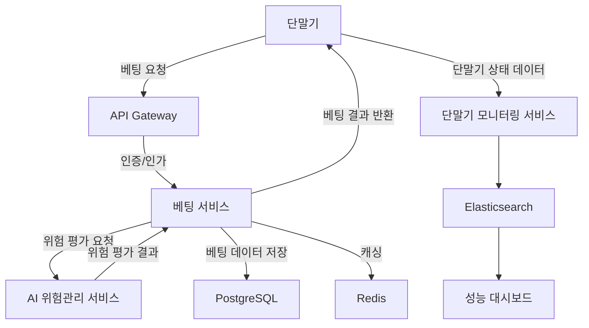

# AI 아키텍처 설계 가이드

## 원본 요구사항
# 🎯 스포츠 토토 발권 및 위험관리 시스템

## 📋 프로젝트 개요

전국 650여개의 토토 발권기와 통신하여 실시간 베팅 발권 및 AI 기반 위험관리를 수행하는 고성능 시스템입니다.

### 🎯 핵심 기능
- **실시간 베팅 발권**: 전국 650개 단말기에서 동시 베팅 처리
- **AI 위험관리**: 실시간 위험 평가 및 자동 차단 시스템
- **단말기 모니터링**: 단말기 상태 실시간 모니터링
- **성능 대시보드**: 시스템 성능 및 위험 현황 시각화

### 📊 성능 요구사항
- **응답 시간**: 최대 10초 이내
- **처리량**: TPS 1,000 지원
- **동시 사용자**: 10만명
- **단말기**: 650개 동시 연결

## 🏗️ 시스템 아키텍처

```
┌─────────────────┐    ┌─────────────────┐    ┌─────────────────┐
│   단말기 (650개)  │────│   API Gateway   │────│  위험관리 엔진   │
└─────────────────┘    └─────────────────┘    └─────────────────┘
                              │
                    ┌─────────────────┐
                    │   FastAPI 서버   │
                    └─────────────────┘
                              │
        ┌─────────────────────┼─────────────────────┐
        │                     │                     │
┌─────────────┐    ┌─────────────┐    ┌─────────────┐
│ PostgreSQL  │    │    Redis    │    │ Monitoring  │
│  (메인 DB)   │    │   (캐시)     │    │ (Prometheus)│
└─────────────┘    └─────────────┘    └─────────────┘
```

### 🔧 기술 스택
- **Backend**: FastAPI, Python 3.11+
- **Database**: PostgreSQL (메인), Redis (캐시)
- **Monitoring**: Prometheus, Grafana
- **Message Queue**: Celery, RabbitMQ
- **Security**: JWT, API Key 인증
- **Deployment**: Docker, Kubernetes

## 🚀 빠른 시작

### 1. 환경 설정

```bash
# 저장소 클론
git clone <repository-url>
cd sports_toto_system

# 가상환경 생성 및 활성화
python -m venv venv
source venv/bin/activate  # Windows: venv\Scripts\activate

# 의존성 설치
pip install -r requirements.txt
```

### 2. 환경변수 설정

`.env` 파일을 생성하고 다음 내용을 설정:

```env
# 기본 설정
ENVIRONMENT=development
DEBUG=true
HOST=0.0.0.0
PORT=8000

# 데이터베이스
POSTGRES_HOST=localhost
POSTGRES_PORT=5432
POSTGRES_DB=sports_toto
POSTGRES_USER=postgres
POSTGRES_PASSWORD=your_password

# Redis
REDIS_HOST=localhost
REDIS_PORT=6379
REDIS_PASSWORD=

# 보안
SECRET_KEY=your-secret-key-here
API_KEY_SALT=your-api-key-salt

# 위험관리
RISK_AUTO_BLOCK_ENABLED=true
RISK_MAX_SINGLE_BET_AMOUNT=1000000
RISK_MAX_DAILY_BET_AMOUNT=10000000
RISK_BLOCK_THRESHOLD=0.8
RISK_ALERT_THRESHOLD=0.6

# 성능
PERFORMANCE_REQUEST_TIMEOUT=10
PERFORMANCE_MAX_WORKERS=4
PERFORMANCE_MAX_CONNECTIONS=100
PERFORMANCE_DB_POOL_SIZE=20
PERFORMANCE_CACHE_TTL=300

# 모니터링
MONITORING_METRICS_ENABLED=true
MONITORING_LOG_LEVEL=INFO
```

### 3. 데이터베이스 설정

```bash
# PostgreSQL 설치 및 실행 (Docker 사용 예시)
docker run --name postgres-toto \
  -e POSTGRES_DB=sports_toto \
  -e POSTGRES_USER=postgres \
  -e POSTGRES_PASSWORD=your_password \
  -p 5432:5432 -d postgres:15

# Redis 설치 및 실행
docker run --name redis-toto \
  -p 6379:6379 -d redis:7-alpine

# 데이터베이스 마이그레이션
alembic upgrade head
```

### 4. 애플리케이션 실행

```bash
# 개발 모드 실행
python main.py

# 또는 uvicorn 직접 실행
uvicorn main:app --host 0.0.0.0 --port 8000 --reload
```

### 5. API 문서 확인

브라우저에서 다음 URL 접속:
- **Swagger UI**: http://localhost:8000/docs
- **ReDoc**: http://localhost:8000/redoc

## 📡 API 엔드포인트

### 베팅 관련 API

#### 베팅 발권
```http
POST /api/v1/betting/place
Content-Type: application/json
Authorization: Bearer <api_key>

{
  "terminal_id": "TERM_001",
  "game_id": "GAME_20241201_001",
  "bet_type": "승부",
  "selection": "홈팀 승",
  "stake": 10000,
  "odds": 1.85,
  "user_id": "USER_123"
}
```

#### 베팅 상태 조회
```http
GET /api/v1/betting/status/{bet_id}
Authorization: Bearer <api_key>
```

#### 베팅 취소
```http
POST /api/v1/betting/cancel
Content-Type: application/json
Authorization: Bearer <api_key>

{
  "bet_id": "BET_20241201_001",
  "reason": "사용자 요청"
}
```

### 위험관리 API

#### 위험 평가 조회
```http
GET /api/v1/risk/assessment/{bet_id}
Authorization: Bearer <api_key>
```

#### 위험 대시보드
```http
GET /api/v1/risk/dashboard
Authorization: Bearer <api_key>
```

### 단말기 관리 API

#### 단말기 상태 조회
```http
GET /api/v1/terminal/{terminal_id}/status
Authorization: Bearer <api_key>
```

#### 단말기 하트비트
```http
POST /api/v1/terminal/{terminal_id}/heartbeat
Authorization: Bearer <api_key>
```

## 🛡️ 보안 기능

### API 키 인증
모든 API 요청은 유효한 API 키가 필요합니다:

```http
Authorization: Bearer <your_api_key>
```

### 위험 평가 시스템
실시간으로 다음 요소들을 평가합니다:

1. **금액 위험**: 베팅 금액 기반 위험도
2. **빈도 위험**: 베팅 빈도 기반 위험도
3. **패턴 위험**: 베팅 패턴 기반 위험도
4. **배당률 위험**: 비정상적 배당률 위험도

### 자동 차단 시스템
- 위험도가 임계값을 초과하면 자동 차단
- 일일 베팅 한도 초과 시 차단
- 비정상 패턴 감지 시 차단

## 📊 모니터링 및 로깅

### 메트릭스 수집
- **Prometheus**: 시스템 메트릭스 수집
- **Grafana**: 대시보드 시각화
- **Custom Metrics**: 베팅, 위험평가 관련 메트릭스

### 로깅
- **구조화된 로깅**: JSON 형태의 로그
- **로그 레벨**: DEBUG, INFO, WARNING, ERROR, CRITICAL
- **로그 집계**: ELK Stack 연동 가능

### 헬스 체크
```http
GET /health
```

### 시스템 정보
```http
GET /system/info
```

### 메트릭스 엔드포인트
```http
GET /metrics
```

## 🔧 설정 관리

### 환경별 설정
- `development`: 개발 환경
- `staging`: 스테이징 환경
- `production`: 운영 환경

### 주요 설정 항목

#### 성능 설정
```python
PERFORMANCE_REQUEST_TIMEOUT = 10  # 요청 타임아웃 (초)
PERFORMANCE_MAX_WORKERS = 4      # 최대 워커 수
PERFORMANCE_MAX_CONNECTIONS = 100 # 최대 연결 수
PERFORMANCE_DB_POOL_SIZE = 20    # DB 연결 풀 크기
```

#### 위험관리 설정
```python
RISK_AUTO_BLOCK_ENABLED = True        # 자동 차단 활성화
RISK_MAX_SINGLE_BET_AMOUNT = 1000000  # 단일 베팅 최대 금액
RISK_MAX_DAILY_BET_AMOUNT = 10000000  # 일일 베팅 최대 금액
RISK_BLOCK_THRESHOLD = 0.8            # 차단 임계값
RISK_ALERT_THRESHOLD = 0.6            # 알림 임계값
```

## 🧪 테스트

### 단위 테스트 실행
```bash
pytest tests/ -v
```

### 커버리지 확인
```bash
pytest --cov=. --cov-report=html
```

### 부하 테스트
```bash
# Locust를 사용한 부하 테스트
locust -f tests/load_test.py --host=http://localhost:8000
```

## 🚀 배포

### Docker 배포
```bash
# 이미지 빌드
docker build -t sports-toto-system .

# 컨테이너 실행
docker run -d \
  --name sports-toto \
  -p 8000:8000 \
  --env-file .env \
  sports-toto-system
```

### Docker Compose 배포
```bash
docker-compose up -d
```

### Kubernetes 배포
```bash
kubectl apply -f k8s/
```

## 📈 성능 최적화

### 데이터베이스 최적화
- 인덱스 최적화
- 쿼리 최적화
- 연결 풀 관리
- 읽기 전용 복제본 활용

### 캐싱 전략
- Redis 캐싱
- 애플리케이션 레벨 캐싱
- CDN 활용

### 비동기 처리
- FastAPI 비동기 처리
- 백그라운드 작업
- 메시지 큐 활용

## 🔍 트러블슈팅

### 일반적인 문제들

#### 1. 데이터베이스 연결 실패
```bash
# 연결 상태 확인
pg_isready -h localhost -p 5432

# 로그 확인
docker logs postgres-toto
```

#### 2. Redis 연결 실패
```bash
# Redis 상태 확인
redis-cli ping

# 로그 확인
docker logs redis-toto
```

#### 3. 성능 이슈
- 메트릭스 확인: `/metrics`
- 시스템 정보 확인: `/system/info`
- 로그 분석

#### 4. 위험평가 오류
- 위험평가 로직 확인
- 임계값 설정 검토
- 데이터 품질 확인

## 📚 추가 문서

- [API 상세 문서](docs/api.md)
- [데이터베이스 스키마](docs/database.md)
- [위험관리 알고리즘](docs/risk_management.md)
- [배포 가이드](docs/deployment.md)
- [모니터링 가이드](docs/monitoring.md)

## 🤝 기여하기

1. Fork the repository
2. Create a feature branch
3. Commit your changes
4. Push to the branch
5. Create a Pull Request

## 📄 라이선스

이 프로젝트는 MIT 라이선스 하에 배포됩니다.

## 📞 지원

- **이슈 리포팅**: GitHub Issues
- **문의사항**: support@example.com
- **문서**: [Wiki](https://github.com/example/sports-toto-system/wiki)

---

## 🏆 주요 특징

### ⚡ 고성능
- **10초 이내 응답**: 모든 API 요청 10초 이내 처리
- **TPS 1,000**: 초당 1,000건의 트랜잭션 처리
- **10만 동시 사용자**: 대규모 동시 접속 지원

### 🛡️ 안전성
- **실시간 위험평가**: AI 기반 실시간 위험 분석
- **자동 차단**: 고위험 베팅 자동 차단
- **감사 로그**: 모든 거래 내역 추적 가능

### 📊 확장성
- **마이크로서비스**: 모듈화된 아키텍처
- **수평 확장**: 로드밸런싱 지원
- **클라우드 네이티브**: Kubernetes 배포 지원

### 🔧 운영성
- **실시간 모니터링**: Prometheus + Grafana
- **자동 복구**: 헬스체크 기반 자동 복구
- **무중단 배포**: Blue-Green 배포 지원 

---

## 1. 요구사항 분석 결과
# 스포츠 토토 발권 및 위험관리 시스템 요구사항 분석

## 핵심 기능 (Core Features)
- **실시간 베팅 발권**: 전국 650개 단말기에서 동시 베팅 처리.
- **AI 위험관리**: 실시간 위험 평가 및 자동 차단 시스템.
- **단말기 모니터링**: 단말기 상태 실시간 모니터링.
- **성능 대시보드**: 시스템 성능 및 위험 현황 시각화.

## 주요 목표 (Key Objectives)
- **고성능 처리**: 최대 10초 이내의 응답 시간과 초당 1,000건의 트랜잭션 처리(TPS 1,000) 달성.
- **안전성 강화**: AI 기반의 실시간 위험 평가 및 자동 차단 기능을 통해 베팅의 안전성 확보.
- **확장성 및 운영성**: 마이크로서비스 아키텍처를 통해 수평 확장 가능하고, 실시간 모니터링 및 자동 복구 기능 제공.

## 사용자 및 규모 (Users & Scale)
- **주 사용자 그룹**: 전국의 스포츠 베팅 사용자 및 운영자.
- **트래픽/데이터 규모**: 최대 10만명의 동시 사용자와 650개의 단말기 동시 연결 지원.

## 성능/보안/기타 제약조건 (Constraints)
- **응답 시간**: 모든 API 요청은 최대 10초 이내에 처리되어야 함.
- **처리량**: 초당 1,000건의 트랜잭션 처리 가능해야 함.
- **동시 사용자**: 최대 10만명의 동시 사용자 지원.
- **단말기 연결**: 650개 단말기와의 동시 연결 필요.
- **보안 수준**: API 키 인증 및 JWT 기반의 보안 요구사항 충족.
- **데이터 민감도**: 베팅 관련 데이터의 안전한 처리 및 저장 필요.

---

## 2. 아키텍처 설계안
### 아키텍처 설계안

#### 1. 아키텍처 스타일 제안 및 이유
**제안: 마이크로서비스 아키텍처**
- **확장성**: 마이크로서비스는 개별 서비스 단위로 수평 확장이 가능하므로, 초당 1,000건의 트랜잭션 처리와 최대 10만명의 동시 사용자 지원 요구사항을 충족할 수 있습니다.
- **안정성**: 각 서비스가 독립적으로 운영되므로 장애가 발생하더라도 전체 시스템에 영향을 최소화할 수 있습니다.
- **운영성**: 서비스별로 배포 및 관리가 가능하며, 실시간 모니터링 및 자동 복구 기능을 쉽게 구현할 수 있습니다.
- **유연성**: AI 위험관리, 단말기 모니터링, 성능 대시보드 등 다양한 기능을 독립적으로 개발 및 배포할 수 있어 개발 속도와 유지보수성이 향상됩니다.

---

#### 2. 주요 기술 스택 추천 및 근거

**프론트엔드**
- **React.js**: 성능 대시보드와 운영자용 UI 개발에 적합하며, 컴포넌트 기반 아키텍처로 재사용성과 유지보수성이 뛰어남.
- **Chart.js/D3.js**: 성능 및 위험 현황을 시각화하기 위한 데이터 시각화 라이브러리.

**백엔드**
- **Node.js + Express.js**: 고성능 비동기 처리와 빠른 응답 시간을 제공하며, 초당 1,000건의 트랜잭션 처리 요구사항을 충족할 수 있음.
- **Python (AI 위험관리)**: AI 모델의 개발 및 배포를 위한 주요 언어로, TensorFlow 또는 PyTorch와 같은 라이브러리를 활용하여 실시간 위험 평가 기능을 구현.

**데이터베이스**
- **PostgreSQL**: 관계형 데이터베이스로, 베팅 관련 데이터의 안전한 저장과 트랜잭션 무결성을 보장.
- **Redis**: 실시간 데이터 캐싱 및 세션 관리에 활용하여 빠른 응답 시간 확보.
- **Elasticsearch**: 단말기 상태 및 성능 데이터를 빠르게 검색하고 분석하기 위한 도구.

**인프라**
- **AWS (Amazon Web Services)**:
  - **EC2**: 백엔드 서비스 및 AI 모델 호스팅.
  - **RDS**: PostgreSQL 관리형 데이터베이스 서비스.
  - **ElastiCache**: Redis 캐싱 서비스.
  - **S3**: 로그 및 기타 비정형 데이터 저장.
  - **CloudWatch**: 실시간 모니터링 및 알림 설정.
- **Docker/Kubernetes**: 컨테이너화 및 오케스트레이션을 통해 서비스의 배포 및 확장성을 강화.

**보안**
- **API Gateway**: API 키 인증 및 JWT 기반 보안 적용.
- **AWS IAM**: 역할 기반 접근 제어를 통해 데이터 민감도를 보호.

---

#### 3. 시스템 핵심 구성 요소 및 데이터 흐름

**핵심 구성 요소**
1. **베팅 서비스**: 실시간 베팅 발권 처리.
2. **AI 위험관리 서비스**: 실시간 위험 평가 및 자동 차단.
3. **단말기 모니터링 서비스**: 단말기 상태를 수집하고 실시간으로 모니터링.
4. **성능 대시보드 서비스**: 운영자에게 시스템 성능 및 위험 현황을 시각화.
5. **데이터베이스**: PostgreSQL(베팅 데이터 저장), Redis(캐싱), Elasticsearch(검색 및 분석).
6. **API Gateway**: 모든 API 요청을 처리하고 인증/인가를 수행.

**데이터 흐름**
1. **베팅 요청**: 단말기에서 API Gateway를 통해 베팅 서비스로 요청을 전송.
2. **위험 평가**: 베팅 서비스는 AI 위험관리 서비스에 데이터를 전달하여 실시간 위험 평가를 수행.
3. **결과 반환**: 위험 평가 결과에 따라 베팅 요청을 승인하거나 차단.
4. **모니터링 데이터**: 단말기 상태 데이터가 단말기 모니터링 서비스로 전송되어 Elasticsearch에 저장.
5. **대시보드 시각화**: Elasticsearch에서 데이터를 조회하여 성능 대시보드에 시각화.

---

#### 4. 간단한 아키텍처 다이어그램 (Mermaid.js)



---

#### 5. 참고 자료 반영 여부
제공된 참고 자료가 없으므로, 요구사항 분석 결과를 기반으로 설계를 진행했습니다. 모든 요구사항(고성능 처리, 안전성 강화, 확장성 및 운영성)을 충족할 수 있는 아키텍처를 제안했으며, 제약조건(응답 시간, 처리량, 보안 수준)을 고려하여 기술 스택과 데이터 흐름을 설계했습니다.

---

#### 결론
이 설계는 요구사항을 충족하면서도 확장 가능하고 안정적인 시스템을 제공합니다. 마이크로서비스 아키텍처와 AWS 기반 인프라를 활용하여 성능, 안정성, 확장성을 극대화하며, AI 위험관리와 실시간 모니터링을 통해 안전성과 운영성을 강화했습니다.

---

## 3. 보안 검토 및 제안
### 보안 검토 및 제안

아키텍처 설계안을 기반으로 잠재적인 보안 위협을 식별하고 이를 완화하기 위한 구체적인 보안 강화 방안을 제안합니다.

---

### 1. 잠재적인 보안 위협 식별

#### 네트워크 보안
- **위협**: API Gateway를 통한 외부 공격 (DDoS, SQL Injection, XSS 등).
- **위협**: 단말기와 서버 간 데이터 전송 중 도청 및 데이터 변조.
- **위협**: 내부 네트워크에서의 비인가 접근.

#### 데이터 보안
- **위협**: 민감한 베팅 데이터의 유출 또는 무단 변경.
- **위협**: 데이터베이스에 대한 직접적인 공격 (예: SQL Injection).
- **위협**: 캐싱 데이터(Redis) 및 로그 데이터(S3)에 대한 무단 접근.

#### 애플리케이션 보안
- **위협**: AI 위험관리 서비스의 모델 조작 또는 데이터 오염.
- **위협**: 애플리케이션 코드의 취약점으로 인한 권한 상승 공격.

#### 접근 제어
- **위협**: 잘못된 IAM 정책으로 인해 과도한 권한 부여.
- **위협**: API 키 및 JWT 토큰 탈취로 인한 비인가 접근.

#### 로깅 및 모니터링
- **위협**: 로그 데이터의 유출 또는 조작으로 인해 보안 사고 탐지 실패.
- **위협**: 실시간 모니터링 시스템의 장애로 인해 공격 탐지 지연.

---

### 2. 보안 강화 방안

#### 네트워크 보안
1. **DDoS 방어**:
   - AWS **Shield** 및 **WAF(Web Application Firewall)**를 활용하여 DDoS 공격을 방어.
   - WAF를 통해 SQL Injection, XSS 등 일반적인 웹 공격을 차단.

2. **데이터 암호화**:
   - 단말기와 서버 간 통신에 **TLS 1.2/1.3**을 적용하여 데이터 전송 중 도청 및 변조 방지.
   - API Gateway에서 HTTPS를 강제 적용.

3. **네트워크 분리**:
   - AWS **VPC**를 활용하여 내부 네트워크와 외부 네트워크를 분리.
   - 보안 그룹(Security Group)을 설정하여 최소 권한의 네트워크 접근만 허용.

4. **IP 제한**:
   - 단말기에서 API Gateway로 접근 가능한 IP를 화이트리스트로 제한.

---

#### 데이터 보안
1. **데이터 암호화**:
   - PostgreSQL 데이터베이스에서 **AES-256**을 사용하여 민감한 베팅 데이터를 암호화.
   - Redis 캐싱 데이터 및 S3 로그 데이터를 **서버 측 암호화(Server-Side Encryption)**로 보호.

2. **데이터베이스 보안**:
   - AWS RDS에서 **IAM 인증**을 활성화하여 데이터베이스 접근을 제한.
   - SQL Injection 방지를 위해 ORM(Object-Relational Mapping) 사용 및 입력값 검증 강화.

3. **백업 및 복구**:
   - S3를 활용하여 데이터베이스의 정기적인 백업을 수행하고, **버전 관리**를 통해 데이터 복구 가능성을 확보.

---

#### 애플리케이션 보안
1. **AI 모델 보호**:
   - AI 위험관리 서비스의 모델 및 데이터에 대한 접근을 IAM 정책으로 제한.
   - 모델 학습 데이터에 대한 무결성 검증을 수행하여 데이터 오염 방지.

2. **코드 취약점 방지**:
   - 정적/동적 코드 분석 도구(SAST/DAST)를 활용하여 애플리케이션 코드의 취약점을 사전에 식별.
   - OWASP Top 10에 따른 보안 코딩 가이드라인 준수.

3. **API 보안**:
   - API Gateway에서 **JWT 토큰 검증**을 수행하여 비인가 접근 방지.
   - 토큰의 만료 시간을 짧게 설정하고, 탈취 방지를 위해 **IP 바인딩**을 적용.

---

#### 접근 제어
1. **IAM 정책 강화**:
   - AWS IAM 역할(Role)을 기반으로 최소 권한 원칙(Principle of Least Privilege)을 적용.
   - 운영자와 개발자, 시스템 간의 권한을 명확히 분리.

2. **API 키 관리**:
   - API 키를 **AWS Secrets Manager** 또는 **Parameter Store**에 저장하여 안전하게 관리.
   - API 키를 정기적으로 회전(Rotation)하여 키 탈취 위험을 줄임.

3. **다중 인증(MFA)**:
   - 운영자 및 관리자 계정에 대해 **MFA(Multi-Factor Authentication)**를 활성화.

---

#### 로깅 및 모니터링
1. **실시간 로그 분석**:
   - AWS **CloudWatch Logs Insights**를 활용하여 실시간 로그 분석 및 경고 알림 설정.
   - Elasticsearch와 Kibana를 연동하여 로그 데이터를 시각화하고 이상 징후를 탐지.

2. **로그 보안**:
   - S3에 저장된 로그 데이터에 대해 **버킷 정책**을 설정하여 비인가 접근 방지.
   - 로그 데이터를 암호화하고, **액세스 감사(Audit Trail)**를 활성화.

3. **침입 탐지 및 대응**:
   - AWS **GuardDuty**를 활성화하여 비정상적인 활동을 탐지.
   - AWS **Config**를 사용하여 보안 설정 변경을 추적하고 자동 복구를 설정.

---

### 3. 규정 준수 및 데이터 민감도 대응

1. **데이터 민감도 보호**:
   - 민감한 베팅 데이터는 **데이터 분류(Data Classification)**를 통해 보호 수준을 정의.
   - 데이터 접근 로그를 기록하여 **GDPR** 또는 **CCPA**와 같은 규정 준수 요구사항을 충족.

2. **규정 준수 도구 활용**:
   - AWS **Artifact**를 통해 규정 준수 보고서를 확인하고, 시스템이 PCI DSS, ISO 27001 등 표준을 준수하도록 설정.

3. **보안 감사**:
   - 정기적인 보안 감사 및 침투 테스트를 수행하여 보안 상태를 점검.
   - AWS **Security Hub**를 활용하여 보안 상태를 중앙에서 관리.

---

### 4. 결론

위의 보안 강화 방안을 통해 설계된 시스템은 다음과 같은 보안 목표를 달성할 수 있습니다:
- **데이터 보호**: 민감한 베팅 데이터를 암호화 및 접근 제어를 통해 안전하게 관리.
- **네트워크 보안**: 외부 공격 및 내부 비인가 접근을 방지.
- **애플리케이션 보안**: AI 모델 및 애플리케이션 코드의 취약점을 최소화.
- **규정 준수**: 데이터 민감도와 관련된 법적 요구사항을 충족.

이러한 보안 조치는 시스템의 안정성과 신뢰성을 높이며, 스포츠 토토 발권 및 위험관리 시스템의 안전한 운영을 보장합니다.

---

## 4. 비용 최적화 방안
### 비용 최적화 방안

#### 1. **AWS 인프라 비용 최적화**
AWS를 기반으로 한 아키텍처에서 비용을 절감하기 위해 다음과 같은 최적화 방안을 제안합니다:

##### **EC2 인스턴스**
- **Reserved Instances**: EC2 인스턴스는 고정적인 워크로드(예: 베팅 서비스 및 AI 위험관리 서비스)에 대해 **1년 또는 3년 예약 인스턴스**를 구매하여 비용을 절감할 수 있습니다. 예약 인스턴스는 On-demand 대비 최대 72% 비용 절감 효과가 있습니다.
- **Spot Instances**: 비핵심 서비스(예: 성능 대시보드, 단말기 모니터링 서비스)는 **Spot Instances**를 활용하여 비용을 절감할 수 있습니다. Spot Instances는 On-demand 대비 최대 90% 저렴합니다.
- **인스턴스 타입 최적화**: 워크로드에 따라 적합한 인스턴스 타입을 선택합니다.
  - **베팅 서비스**: 고성능 처리와 빠른 응답이 필요하므로 **c5.large** 또는 **c5.xlarge**와 같은 컴퓨팅 최적화 인스턴스를 추천합니다.
  - **AI 위험관리 서비스**: AI 모델 실행에 GPU가 필요하다면 **g4dn.xlarge**와 같은 GPU 최적화 인스턴스를 활용합니다.
  - **단말기 모니터링 및 대시보드**: 상대적으로 낮은 컴퓨팅 요구사항이 있으므로 **t3.medium**과 같은 저비용 인스턴스를 활용합니다.

##### **RDS (PostgreSQL)**
- **Reserved Instances**: RDS도 예약 인스턴스를 활용하여 비용을 절감합니다.
- **스토리지 티어링**: RDS의 스토리지를 **General Purpose SSD (gp2)**에서 **Provisioned IOPS SSD (io1)**로 변경할 필요가 있는 경우, IOPS 요구사항을 정확히 계산하여 과도한 비용을 방지합니다.
- **Auto Scaling**: RDS의 읽기 복제본을 Auto Scaling으로 설정하여 트래픽 증가 시 자동으로 확장하고, 트래픽 감소 시 복제본을 줄여 비용을 절감합니다.

##### **ElastiCache (Redis)**
- **Cluster Mode Disabled**: Redis 클러스터를 단일 노드로 구성하여 초기 비용을 절감하고, 필요 시 클러스터 모드로 확장합니다.
- **Reserved Nodes**: Redis 노드도 예약 인스턴스를 활용하여 비용을 절감합니다.

##### **Elasticsearch**
- **Hot-Warm Architecture**: Elasticsearch의 데이터를 **Hot-Warm 티어링**으로 구성하여 자주 조회되는 데이터는 고성능 노드에 저장하고, 오래된 데이터는 저비용 노드에 저장합니다.
- **Spot Instances**: Elasticsearch 클러스터의 일부 노드를 Spot Instances로 구성하여 비용을 절감합니다.

##### **S3**
- **스토리지 클래스 최적화**: S3의 데이터를 **Intelligent-Tiering**으로 설정하여 자주 액세스되지 않는 데이터는 자동으로 저비용 스토리지로 이동하도록 구성합니다.
- **라이프사이클 정책**: 오래된 로그 데이터를 자동으로 Glacier로 이동하여 비용을 절감합니다.

##### **CloudWatch**
- **로그 필터링**: CloudWatch 로그를 필터링하여 불필요한 로그를 저장하지 않도록 설정합니다.
- **로그 보관 정책**: 오래된 로그는 S3로 이동하여 CloudWatch 로그 저장 비용을 줄입니다.

---

#### 2. **컨테이너 오케스트레이션 비용 최적화**
- **EKS (Elastic Kubernetes Service)**: Kubernetes 클러스터를 운영할 경우, 워크로드에 따라 **Fargate**를 활용하여 서버리스 컨테이너를 실행하거나, 클러스터 노드를 Spot Instances로 구성하여 비용을 절감합니다.
- **Horizontal Pod Autoscaler (HPA)**: 서비스별로 HPA를 설정하여 트래픽 증가 시 자동으로 확장하고, 트래픽 감소 시 리소스를 줄여 비용을 최적화합니다.

---

#### 3. **서버리스 비용 최적화**
- **Lambda 함수 메모리 최적화**: Lambda 함수를 사용하는 경우, 메모리와 실행 시간을 최적화하여 비용을 절감합니다. 메모리 설정을 최소화하고, 실행 시간을 줄이는 코드를 작성합니다.
- **Provisioned Concurrency**: Lambda의 응답 시간을 보장해야 하는 경우, Provisioned Concurrency를 설정하여 비용을 절감합니다.

---

#### 4. **트레이드오프 제안 (성능 vs 비용)**
- **AI 위험관리 서비스**: GPU 인스턴스(g4dn.xlarge)는 비용이 높으므로, 실시간 위험 평가의 정확도를 약간 낮추고 CPU 기반 인스턴스(c5.xlarge)로 전환하여 비용을 절감할 수 있습니다.
- **Elasticsearch**: Hot-Warm 티어링을 적용하면 검색 성능이 약간 저하될 수 있지만, 비용 절감 효과가 큽니다.
- **단말기 모니터링 서비스**: 단말기 상태 데이터를 실시간으로 처리하지 않고, 일정 주기로 배치 처리하여 비용을 절감할 수 있습니다.

---

#### 5. **초기 구축 비용 및 월별 예상 운영 비용**
##### **초기 구축 비용**
- **EC2 Reserved Instances**: 1년 예약 인스턴스 구매 비용 (예: c5.large 3대, g4dn.xlarge 1대) 약 $5,000.
- **RDS Reserved Instances**: PostgreSQL 1년 예약 인스턴스 약 $2,000.
- **ElastiCache Reserved Nodes**: Redis 1년 예약 노드 약 $1,500.
- **Elasticsearch 클러스터 구성**: 초기 클러스터 구성 비용 약 $3,000.
- **S3 스토리지**: 초기 데이터 저장 비용 약 $500.
- **CloudWatch 설정 및 모니터링**: 초기 설정 비용 약 $500.

**총 초기 구축 비용**: 약 $12,500.

##### **월별 예상 운영 비용**
- **EC2**: Reserved Instances 및 Spot Instances 활용 시 약 $1,500.
- **RDS**: 약 $500.
- **ElastiCache**: 약 $300.
- **Elasticsearch**: 약 $700.
- **S3**: 약 $200.
- **CloudWatch**: 약 $100.

**총 월별 운영 비용**: 약 $3,300.

---

#### 결론
위 최적화 방안을 통해 초기 구축 비용은 약 $12,500, 월별 운영 비용은 약 $3,300로 예상됩니다. 비용 절감 효과를 극대화하기 위해 Reserved Instances와 Spot Instances를 적극 활용하고, 스토리지 티어링 및 서버리스 메모리 최적화를 적용했습니다. 성능과 비용 간의 트레이드오프를 고려하여 요구사항을 충족하면서도 예산 제약을 준수할 수 있는 최적의 방안을 제안했습니다.

---

## 5. DevOps/운영 전략
### DevOps/운영 전략

#### 1. **CI/CD 파이프라인**
**목표:** 코드 통합, 빌드, 테스트, 배포를 자동화하여 신속하고 안정적인 배포를 지원.

**구성 방안:**
- **CI/CD 도구:** GitHub Actions 또는 Jenkins
  - **GitHub Actions**: GitHub과의 통합이 원활하며, YAML 기반으로 간단한 설정 가능.
  - **Jenkins**: 플러그인 생태계가 풍부하며, 복잡한 워크플로우를 처리하기에 적합.

**파이프라인 단계:**
1. **코드 통합 및 빌드**
   - 코드 푸시 시 자동으로 트리거.
   - 각 마이크로서비스별로 독립적인 빌드 수행.
   - Docker 이미지를 생성하고 Docker Registry(e.g., AWS ECR, Docker Hub)에 저장.
2. **테스트**
   - **단위 테스트:** Jest, Mocha 등으로 각 서비스의 테스트 수행.
   - **통합 테스트:** Postman/Newman 또는 Cypress로 API 통합 테스트.
   - **부하 테스트:** k6 또는 JMeter를 사용하여 TPS 1,000 이상을 검증.
3. **보안 검사**
   - **정적 코드 분석:** SonarQube 또는 CodeQL로 코드 품질 및 보안 취약점 검사.
   - **의존성 검사:** Snyk 또는 Dependabot으로 라이브러리 취약점 점검.
4. **배포**
   - **스테이징 환경 배포:** Kubernetes 클러스터에 배포하여 최종 검증.
   - **프로덕션 환경 배포:** 무중단 배포 전략(블루/그린 또는 카나리)을 사용하여 안정성 확보.

**예시 GitHub Actions 워크플로우 (YAML):**
```yaml
name: CI/CD Pipeline

on:
  push:
    branches:
      - main

jobs:
  build:
    runs-on: ubuntu-latest
    steps:
      - name: Checkout code
        uses: actions/checkout@v3
      
      - name: Set up Node.js
        uses: actions/setup-node@v3
        with:
          node-version: '16'

      - name: Install dependencies
        run: npm install

      - name: Run tests
        run: npm test

      - name: Build Docker image
        run: docker build -t my-service:${{ github.sha }} .

      - name: Push Docker image to ECR
        run: |
          aws ecr get-login-password --region us-east-1 | docker login --username AWS --password-stdin <ECR_REPOSITORY>
          docker tag my-service:${{ github.sha }} <ECR_REPOSITORY>/my-service:${{ github.sha }}
          docker push <ECR_REPOSITORY>/my-service:${{ github.sha }}

  deploy:
    needs: build
    runs-on: ubuntu-latest
    steps:
      - name: Deploy to Kubernetes
        run: kubectl apply -f k8s/deployment.yaml
```

---

#### 2. **IaC (Infrastructure as Code)**
**목표:** 인프라를 코드로 관리하여 일관성과 재현성을 확보.

**추천 도구:**
- **Terraform:** 클라우드 간 호환성이 뛰어나며, AWS 리소스를 코드로 관리 가능.
- **AWS CloudFormation:** AWS에 최적화된 IaC 도구로, YAML/JSON 기반 템플릿 제공.

**구성 방안:**
- **Terraform 모듈화**
  - **네트워크 모듈:** VPC, 서브넷, 보안 그룹 설정.
  - **컴퓨팅 모듈:** EC2, ECS, EKS 등 컴퓨팅 리소스 생성.
  - **데이터베이스 모듈:** RDS(PostgreSQL), ElastiCache(Redis) 설정.
  - **모니터링 모듈:** CloudWatch, Elasticsearch 설정.
- **GitOps 도입**
  - IaC 코드를 Git에 저장하고, 변경 사항을 PR로 관리.
  - Terraform Cloud 또는 Atlantis를 사용하여 코드 변경 시 자동으로 Terraform Plan 및 Apply 수행.

**예시 Terraform 코드:**
```hcl
provider "aws" {
  region = "us-east-1"
}

module "vpc" {
  source = "terraform-aws-modules/vpc/aws"
  name   = "sports-toto-vpc"
  cidr   = "10.0.0.0/16"
  azs    = ["us-east-1a", "us-east-1b"]
  public_subnets  = ["10.0.1.0/24", "10.0.2.0/24"]
  private_subnets = ["10.0.3.0/24", "10.0.4.0/24"]
}

module "eks" {
  source          = "terraform-aws-modules/eks/aws"
  cluster_name    = "sports-toto-cluster"
  cluster_version = "1.26"
  subnets         = module.vpc.private_subnets
  vpc_id          = module.vpc.vpc_id
}
```

---

#### 3. **모니터링 및 로깅**
**목표:** 시스템 상태를 실시간으로 파악하고 문제 발생 시 신속히 대응.

**추천 도구:**
- **모니터링**
  - **Prometheus + Grafana:** 실시간 메트릭 수집 및 대시보드 시각화.
  - **AWS CloudWatch:** AWS 리소스 상태 모니터링 및 알림 설정.
- **로깅**
  - **Elasticsearch + Kibana (ELK 스택):** 로그 수집, 검색 및 분석.
  - **Fluentd/Logstash:** 애플리케이션 및 시스템 로그를 중앙화하여 Elasticsearch로 전송.

**구성 방안:**
- **애플리케이션 레벨**
  - 각 마이크로서비스에 Prometheus Exporter를 설치하여 메트릭 수집.
  - 로그는 JSON 형식으로 출력하여 Fluentd로 수집.
- **인프라 레벨**
  - Kubernetes 클러스터 메트릭은 Prometheus로 수집.
  - AWS 리소스 메트릭은 CloudWatch로 수집.
- **알림**
  - Grafana와 Slack/Email 연동하여 임계치 초과 시 알림 전송.

**예시 Prometheus 설정 (Kubernetes):**
```yaml
apiVersion: monitoring.coreos.com/v1
kind: ServiceMonitor
metadata:
  name: sports-toto-monitor
spec:
  selector:
    matchLabels:
      app: sports-toto
  endpoints:
    - port: http
      path: /metrics
      interval: 15s
```

---

#### 4. **배포 전략**
**목표:** 무중단 배포를 통해 사용자 경험을 보장.

**추천 전략:**
- **블루/그린 배포**
  - 두 개의 환경(블루와 그린)을 운영하며, 새 버전을 그린 환경에 배포 후 트래픽을 전환.
  - AWS Elastic Load Balancer(ELB)를 사용하여 트래픽 스위칭 구현.
- **카나리 배포**
  - 새 버전을 소수의 사용자에게 먼저 배포하여 안정성을 검증한 후 점진적으로 트래픽을 증가.
  - Kubernetes의 **Argo Rollouts** 또는 **Flagger**를 사용하여 구현.

**구성 방안:**
- **Kubernetes 블루/그린 배포 예시:**
```yaml
apiVersion: apps/v1
kind: Deployment
metadata:
  name: sports-toto-green
spec:
  replicas: 3
  selector:
    matchLabels:
      app: sports-toto
  template:
    metadata:
      labels:
        app: sports-toto
        version: green
    spec:
      containers:
      - name: sports-toto
        image: <ECR_REPOSITORY>/sports-toto:green
```

- **Argo Rollouts 카나리 배포 예시:**
```yaml
apiVersion: argoproj.io/v1alpha1
kind: Rollout
metadata:
  name: sports-toto-rollout
spec:
  strategy:
    canary:
      steps:
      - setWeight: 10
      - pause: { duration: 5m }
      - setWeight: 50
      - pause: { duration: 10m }
      - setWeight: 100
  replicas: 3
  selector:
    matchLabels:
      app: sports-toto
  template:
    metadata:
      labels:
        app: sports-toto
    spec:
      containers:
      - name: sports-toto
        image: <ECR_REPOSITORY>/sports-toto:latest
```

---

### 결론
위 전략은 요구사항에 맞는 고성능, 안정성, 확장성을 보장하며, DevOps 관점에서 효율적이고 자동화된 운영을 지원합니다. CI/CD 파이프라인, IaC, 모니터링 및 로깅, 배포 전략을 통합적으로 활용하여 시스템의 안정성과 운영성을 극대화할 수 있습니다.

---

## 최종 설계 가이드 요약
### 최종 설계 가이드

---

#### **프로젝트 요약**
스포츠 토토 발권 및 위험관리 시스템은 전국 650개 단말기와 최대 10만명의 동시 사용자를 지원하며, 실시간 베팅 발권, AI 기반 위험관리, 단말기 상태 모니터링, 성능 대시보드 기능을 제공합니다. 이 시스템은 초당 1,000건의 트랜잭션 처리(TPS 1,000)와 10초 이내의 응답 시간을 목표로 하며, 안전성과 확장성을 강화하기 위해 마이크로서비스 아키텍처와 AWS 기반 인프라를 활용합니다.

---

#### **핵심 아키텍처**
1. **아키텍처 스타일**: 마이크로서비스 아키텍처를 채택하여 확장성과 안정성을 극대화.
2. **기술 스택**:
   - **프론트엔드**: React.js, Chart.js/D3.js를 활용한 성능 대시보드 개발.
   - **백엔드**: Node.js + Express.js로 고성능 API 처리, Python으로 AI 위험관리 구현.
   - **데이터베이스**: PostgreSQL(관계형 데이터 저장), Redis(캐싱), Elasticsearch(검색 및 분석).
   - **인프라**: AWS EC2, RDS, ElastiCache, S3, CloudWatch, Docker/Kubernetes.
   - **보안**: API Gateway, JWT 인증, AWS IAM 기반 접근 제어.
3. **데이터 흐름**:
   - 단말기에서 API Gateway를 통해 베팅 요청 → AI 위험관리 서비스에서 실시간 평가 → 결과 반환 및 데이터 저장 → Elasticsearch를 통한 모니터링 및 대시보드 시각화.

---

#### **주요 고려사항**
1. **보안**:
   - TLS 1.2/1.3을 통한 데이터 암호화.
   - AWS WAF 및 Shield를 활용한 DDoS 방어.
   - 민감한 데이터 암호화(AES-256) 및 IAM 기반 접근 제어.
2. **비용 최적화**:
   - Reserved Instances 및 Spot Instances를 활용하여 EC2, RDS, Redis 비용 절감.
   - S3 Intelligent-Tiering 및 데이터 라이프사이클 정책으로 스토리지 비용 최적화.
   - Hot-Warm 티어링을 통한 Elasticsearch 비용 절감.
3. **운영성**:
   - CI/CD 파이프라인으로 자동화된 빌드, 테스트, 배포 구현.
   - Prometheus + Grafana 및 AWS CloudWatch를 통한 실시간 모니터링.
   - 블루/그린 및 카나리 배포 전략으로 무중단 배포 보장.

---

#### **권장 실행 계획 (Action Plan)**
1. **PoC 개발**:
   - 핵심 기능(베팅 서비스, AI 위험관리, 단말기 모니터링)의 프로토타입을 개발하여 성능 및 안정성을 검증.
   - AWS 기반 인프라를 설정하고 초기 테스트 환경 구축.
2. **상세 설계**:
   - 각 마이크로서비스의 상세 설계 및 데이터 흐름 정의.
   - 보안 정책 및 IAM 역할을 세부적으로 설정.
3. **인프라 구축**:
   - Terraform을 활용하여 AWS 리소스를 코드로 관리하며 인프라를 구축.
   - Kubernetes 클러스터를 설정하고 서비스 배포 준비.
4. **성능 및 보안 테스트**:
   - JMeter/k6를 활용하여 초당 1,000건의 트랜잭션 처리 성능 테스트.
   - 침투 테스트 및 정적 코드 분석으로 보안 취약점 점검.
5. **운영 및 모니터링**:
   - Prometheus + Grafana 및 Elasticsearch + Kibana를 통해 실시간 모니터링 환경 구축.
   - CloudWatch와 Slack/Email 알림을 연동하여 운영 효율성 강화.
6. **최종 배포**:
   - 블루/그린 배포를 통해 안정적으로 프로덕션 환경에 시스템 배포.
   - 사용자 피드백을 수집하여 지속적인 개선 수행.

---

### 결론
이 설계는 고성능, 안전성, 확장성을 모두 충족하며, 비용 효율적인 운영과 DevOps 자동화를 통해 시스템의 안정성을 극대화합니다. 권장 실행 계획을 단계적으로 수행하여 프로젝트를 성공적으로 완료할 수 있습니다.
